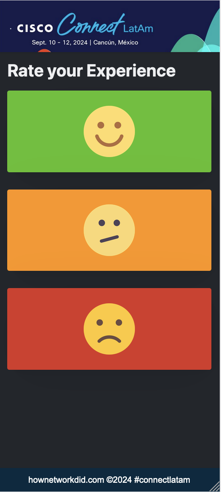

# Collect User Feedback "How We Did it?"

Basic Tool to Collect user feedback using smiley face icons

## User Interface

## How to use

clone this repo

Execute:

`npm -i`

then run

`npm start api.js`

by default ExpressJS serves on port 3000

## Stack

NodeJS
ExpressJS
Vanilla JS
PicoCSS
HTML5
Sqlite3
